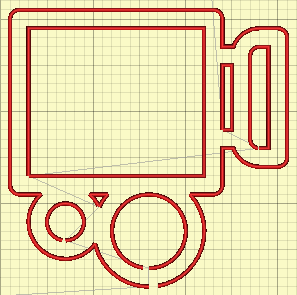

# svg2gcode
Converter from SVG PATHS to GCODE

---
Usage: `./svg2gcode [filepath2svg] [function to transform X axis] [function to transform Y asix]`

Transforming function example: `1x+2`, `2x+-2`, `10y+-20`

---
Path commands:
- &#9745; mM
- &#9745; lL
- &#9745; vV
- &#9745; hH 
- &#9745; zZ
- &#9745; aA
- &#9745; cC
- &#9745; sS
- &#9744; tT
- &#9744; qQ

---
TODO:
* add ImGui and convert project to C++
* handle rest path commands
* reduce code in functions that draw bezier
* reduce code in parser function
* handle polyline, circle and ellipse tags
* ~~write proper makefile~~
